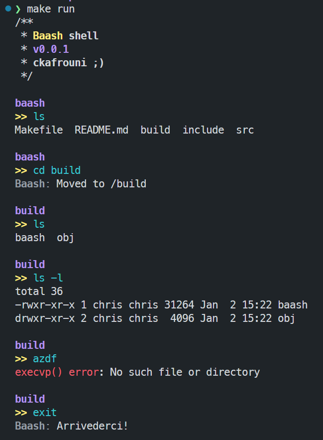

# Baash

Baash is a basic implementation of a bash-like shell. It supports a few basic builtin commands like `cd`, `exit`, `clear`, and `pwd`.

## Example

Here is an example of how to use Baash:



## Getting Started

These instructions will get you a copy of the project up and running on your local machine for development and testing purposes.

### Prerequisites

- GCC
- Make

### Building

To build the project, run the following command in the root directory of the project:

```sh
make all
```

This will compile the source files and link them into an executable in the `build` directory.

### Running

To run the built executable, use the following command:

```sh
make run # or ./build/baash
```

## Features

### Builtins

Baash supports the following builtin commands:

- `cd`: Change the current directory to `<path>`.
- `exit`: Exit the shell.
- `clear`: Clear the terminal screen.
- `pwd`: Print the current working directory.

### Program Execution

Baash supports executing programs in the current working directory. To execute a program, simply type the name of the program and press enter. Baash will spawn a child process to execute the program.

- `<program>`: Looks for the program in the `PATH` environment variable.
- `./<program>`: Looks for the program in the current working directory.

## Todo

### Builtin Commands and Execution

- `./<program>`: spawn a child process to execute the program.
- `history`: builtin cmd, and read/write on shell start/close.
- `cd`: Change the current directory to `$HOME`.
- `environment variables`: support for environment variables.

### Other Features

- `raw mode`: sets the terminal to raw mode, and supports arrow keys, backspace, and delete.
- `colorize the input`: colorize and validate the input as the user types it.
- `configurable prompt`: allow the user to configure the prompt.
- `configuration file`: allow the user to configure the shell via a configuration file. (.baash.cfg?)
